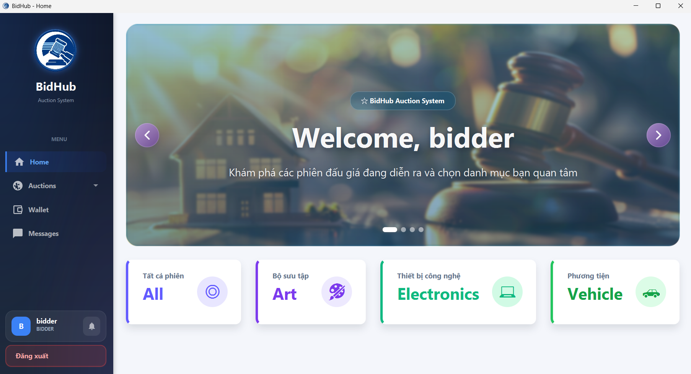

# Hệ thống Đấu giá trực tuyến: BidHub

Dự án bài tập lớn môn **Lập trình nâng cao** - Nhóm 6. Hệ thống mô phỏng nền tảng đấu giá trực tuyến với kiến trúc Client-Server, xử lý đa luồng và cập nhật dữ liệu thời gian thực.

## 1. Công nghệ sử dụng và Môi trường
* **Ngôn ngữ:** Java 21 (LTS)
* **Giao diện:** JavaFX 21
* **Cơ sở dữ liệu:** MySQL 8.0
* **Quản lý dự án:** Maven
* **Đóng gói:** Launch4j
* **Triển khai:** Server chạy 24/7 trên VPS Digital Ocean

## 2. Giao diện ứng dụng

*(Hình ảnh minh họa giao diện chính của hệ thống)*

## 3. Cấu trúc module chính

| Thư mục | Chức năng chính |
| :--- | :--- |
| `application` | Khởi chạy Client và quản lý Scene |
| `controller` | Xử lý logic giao diện (Admin, User, Chat, Wallet) |
| `database` | Tầng truy xuất dữ liệu (DAO Pattern) |
| `model` | Định nghĩa các thực thể (User, Item, Auction, Notification) |
| `network` | Giao tiếp Socket TCP và đa luồng |
| `utils` | Các dịch vụ hỗ trợ (Animation, Image service, bảo mật) |

## 4. Danh sách chức năng đã hoàn thành

### 4.1. Chức năng bắt buộc
* **Quản lý người dùng:** Đăng ký, đăng nhập và phân quyền 3 vai trò (Bidder, Seller, Admin).
* **Quản lý sản phẩm:** Thêm, sửa, xóa thông tin sản phẩm (Điện tử, Nghệ thuật, Phương tiện).
* **Tham gia đấu giá:** Đặt giá hợp lệ, kiểm tra bước giá và cập nhật người dẫn đầu.
* **Kết thúc phiên:** Tự động đóng phiên theo thời gian thực, xác định người thắng cuộc.
* **Xử lý ngoại lệ:** Bắt lỗi kết nối từ xa, ngăn chặn đặt giá khi phiên đã kết thúc hoặc giá không hợp lệ.

### 4.2. Chức năng nâng cao
* **Auto-Bidding (Đấu giá tự động):** Hệ thống tự động trả giá thay người dùng dựa trên giá tối đa và bước giá thiết lập.
* **Xử lý đồng thời (Concurrent Bidding):** Sử dụng `ReentrantLock` đảm bảo an toàn dữ liệu khi có nhiều người cùng đặt giá tại một thời điểm.
* **Anti-sniping Algorithm:** Tự động gia hạn thêm thời gian nếu có lượt đặt giá mới xuất hiện ở những giây cuối của phiên.
* **Realtime Update:** Cập nhật thông tin tức thì cho toàn bộ Client thông qua giao thức Socket (Observer Pattern).
* **Biểu đồ giá:** Vẽ đồ thị đường (Line Chart) mô phỏng biến động giá theo thời gian thực.

### 4.3. Tính năng sáng tạo nổi bật
* **Live Deployment:** Server và Database được cấu hình và duy trì 24/7 trên VPS Digital Ocean.
* **Native Packaging:** Sử dụng Launch4j đóng gói Client thành file `.exe`, giúp khởi chạy trên Windows.
* **Hệ thống Ví & Giao dịch:** Quản lý số dư, nạp tiền, tự động khóa tiền tạm thời khi tham gia đấu giá để đảm bảo khả năng thanh toán.
* **Thông báo đẩy (Push Notifications):** Cảnh báo thời gian thực về trạng thái đấu giá, tài chính và tương tác xã hội.
* **Tính năng cộng đồng:** Hỗ trợ kết bạn và nhắn tin trực tiếp (Realtime Chat) giữa các người dùng.
* **Admin Dashboard:** Giao diện quản trị tập trung để phê duyệt người bán, quản lý phiên đấu giá và dòng tiền.

## 5. Hướng dẫn chạy chương trình (Dành cho người dùng)

Hệ thống Server và CSDL hiện đang hoạt động 24/7 trên VPS, người dùng cần tải Client về để kết nối và sử dụng.

**Cách 1: Sử dụng bản cài đặt đóng gói sẵn **
1. Truy cập mục **Releases** trên GitHub của dự án (hoặc tải trực tiếp file zip đính kèm).
2. Giải nén thư mục `BidHub-Release`.
3. Chạy file `BidHub.exe` (Yêu cầu máy tính có cài sẵn Java 17 trở lên).

**Cách 2: Build và chạy từ mã nguồn**
* Chạy trực tiếp qua plugin:
  ```bash
  mvn javafx:run
  ```
* Hoặc tự đóng gói thành file `.exe`:
  ```bash
  mvn clean verify -Ppackage-client
  ```
  Sau đó chạy file `BidHub.exe` nằm trong thư mục `target/`.

**Cách 3: Chạy từ file JAR**
Bạn cũng có thể chạy file JAR (đã bao gồm đầy đủ thư viện):
```bash
java -jar target/bidhub-client.jar
```
*(Lưu ý: File JAR này được tạo ra sau khi chạy lệnh build ở Cách 2).*

## 6. Tài liệu và Demo
* **Tải bản Release (.exe):** [Link tới mục Release trên Github của bạn]
* **Báo cáo chi tiết (PDF):** [Đang cập nhật]
* **Video Demo hệ thống:** [Đang cập nhật]

## 7. Thiết kế OOP và Design Patterns
* **OOP:** Áp dụng triệt để Kế thừa (User, Item), Đóng gói và Đa hình.
* **Design Patterns:**
  * **Singleton:** Quản lý cấu hình, kết nối Database.
  * **Factory Method:** Khởi tạo các loại sản phẩm khác nhau.
  * **Observer:** Đồng bộ dữ liệu Realtime qua Socket.
  * **DAO Pattern:** Tách biệt logic truy xuất dữ liệu.
