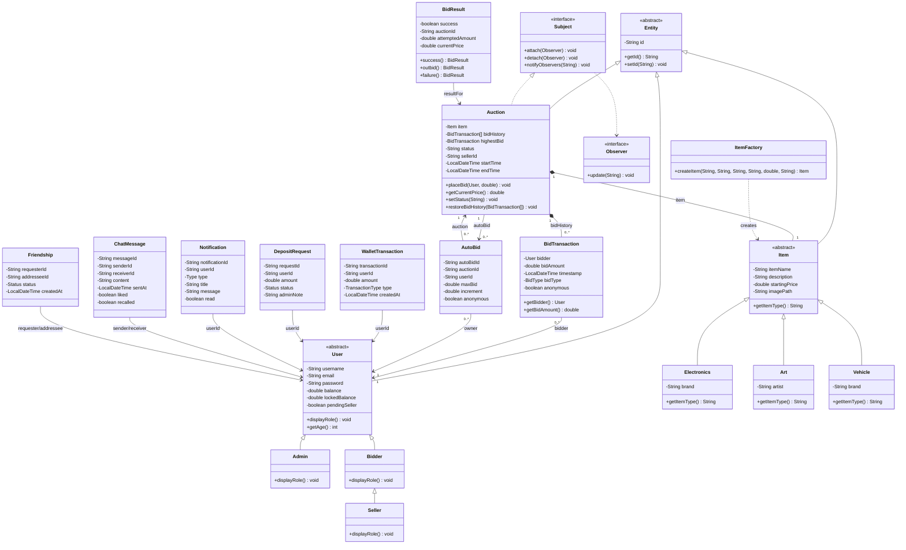
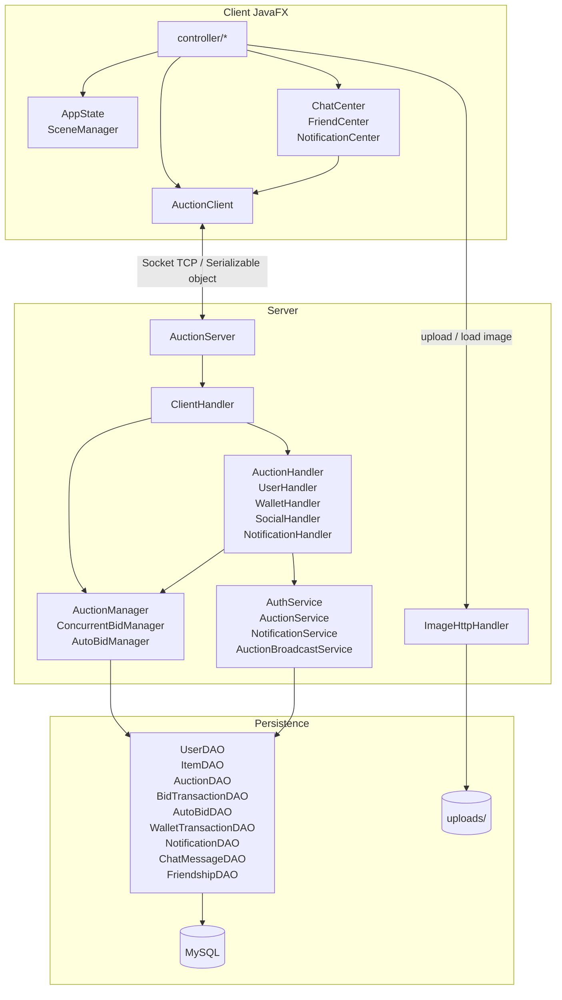
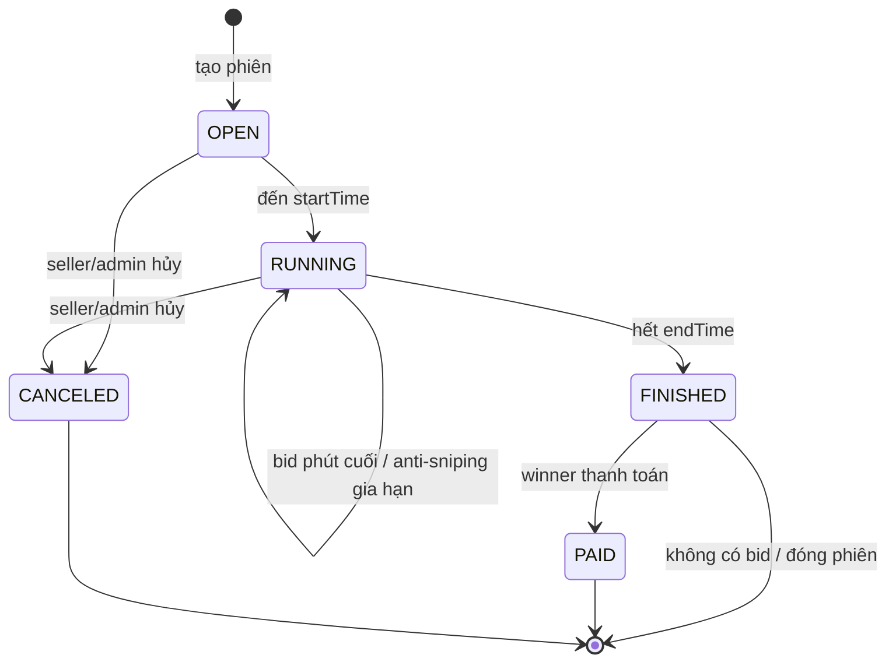
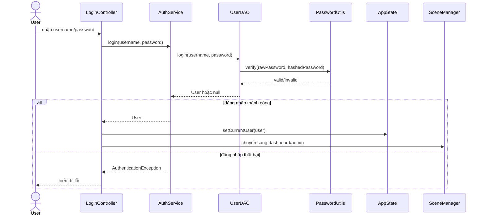
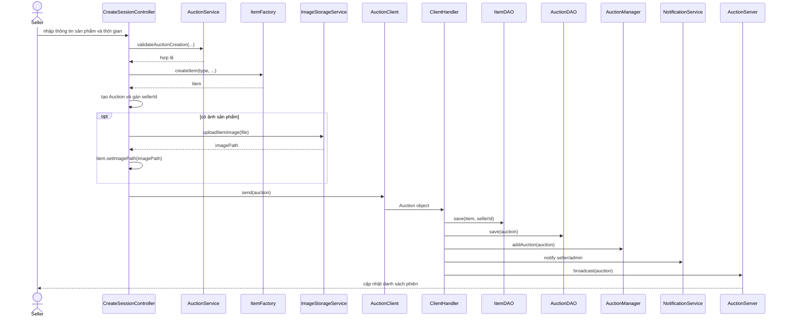
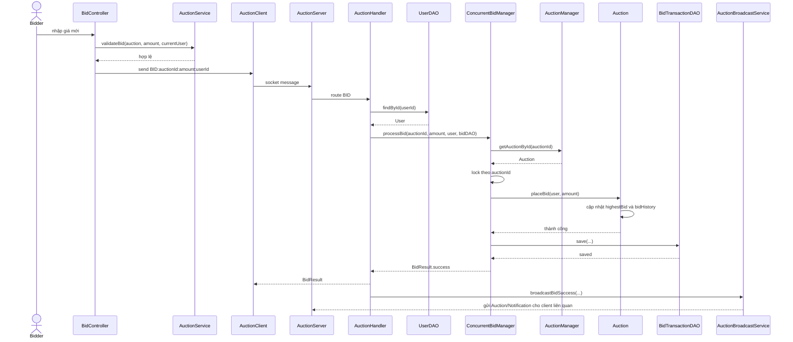
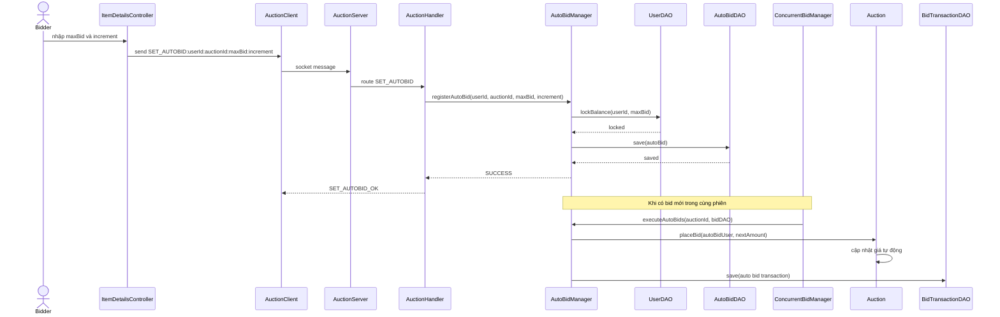
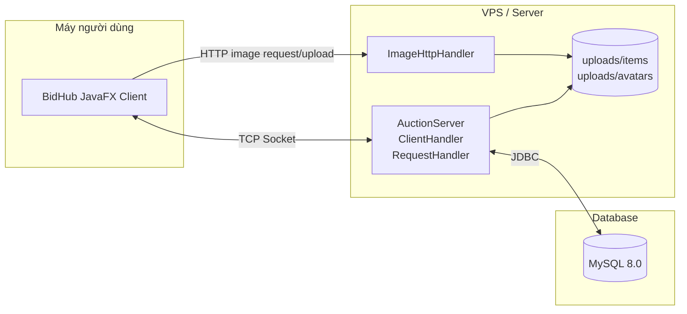

# UML BidHub - Online Auction System

## 1. Domain Class Diagram

## 2. Component Diagram

## 3. Auction State Diagram

## 4. Sequence Diagram - Đăng nhập

## 5. Sequence Diagram - Tạo phiên đấu giá

## 6. Sequence Diagram - Đặt giá đấu giá

## 7. Sequence Diagram - Auto-bid

## 8. Deployment Diagram

