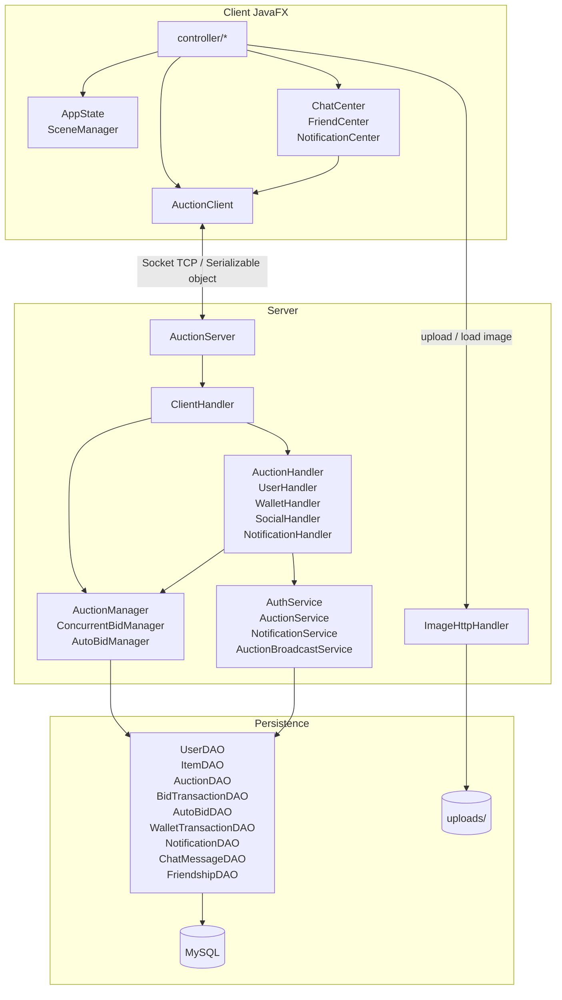
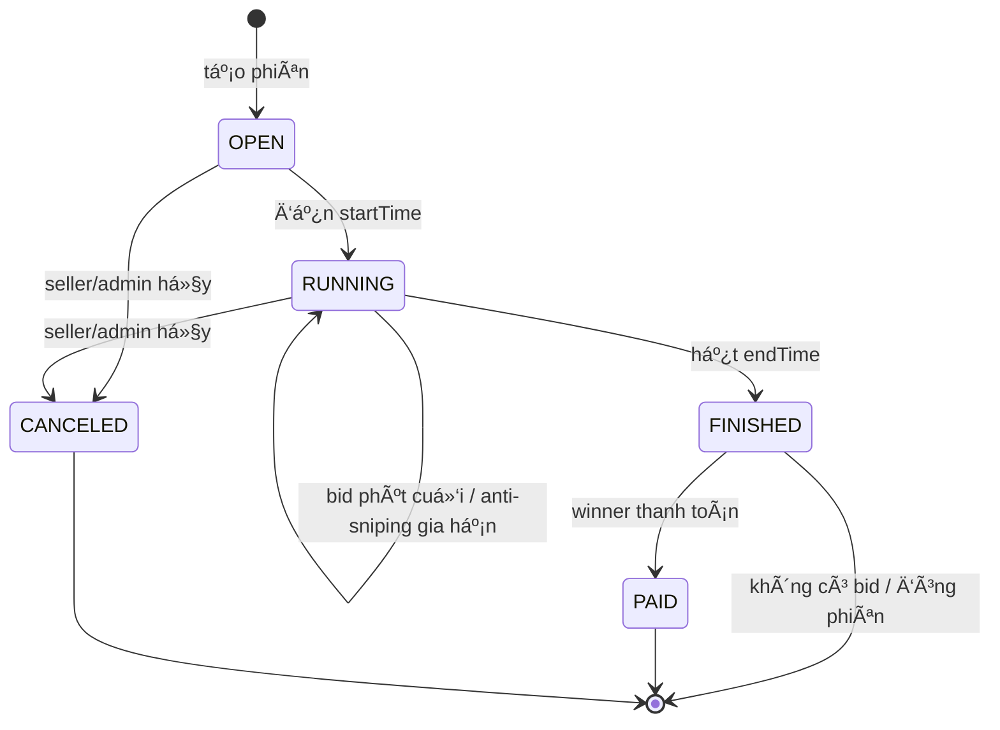

# UML BidHub - Online Auction System

## 1. Domain Class Diagram

```mermaid
classDiagram
    direction TB

    class Entity {
        <<abstract>>
        -String id
        +getId() String
        +setId(String) void
    }

    class User {
        <<abstract>>
        -String username
        -String email
        -String password
        -double balance
        -double lockedBalance
        -boolean pendingSeller
        +displayRole() void
        +getAge() int
    }

    class Admin {
        +displayRole() void
    }

    class Bidder {
        +displayRole() void
    }

    class Seller {
        +displayRole() void
    }

    class Item {
        <<abstract>>
        -String itemName
        -String description
        -double startingPrice
        -String imagePath
        +getItemType() String
    }

    class Electronics {
        -String brand
        +getItemType() String
    }

    class Art {
        -String artist
        +getItemType() String
    }

    class Vehicle {
        -String brand
        +getItemType() String
    }

    class ItemFactory {
        +createItem(String, String, String, String, double, String) Item
    }

    class Subject {
        <<interface>>
        +attach(Observer) void
        +detach(Observer) void
        +notifyObservers(String) void
    }

    class Observer {
        <<interface>>
        +update(String) void
    }

    class Auction {
        -Item item
        -BidTransaction[] bidHistory
        -BidTransaction highestBid
        -String status
        -String sellerId
        -LocalDateTime startTime
        -LocalDateTime endTime
        +placeBid(User, double) void
        +getCurrentPrice() double
        +setStatus(String) void
        +restoreBidHistory(BidTransaction[]) void
    }

    class BidTransaction {
        -User bidder
        -double bidAmount
        -LocalDateTime timestamp
        -BidType bidType
        -boolean anonymous
        +getBidder() User
        +getBidAmount() double
    }

    class AutoBid {
        -String autoBidId
        -String auctionId
        -String userId
        -double maxBid
        -double increment
        -boolean anonymous
    }

    class BidResult {
        -boolean success
        -String auctionId
        -double attemptedAmount
        -double currentPrice
        +success() BidResult
        +outbid() BidResult
        +failure() BidResult
    }

    class WalletTransaction {
        -String transactionId
        -String userId
        -double amount
        -TransactionType type
        -LocalDateTime createdAt
    }

    class DepositRequest {
        -String requestId
        -String userId
        -double amount
        -Status status
        -String adminNote
    }

    class Notification {
        -String notificationId
        -String userId
        -Type type
        -String title
        -String message
        -boolean read
    }

    class ChatMessage {
        -String messageId
        -String senderId
        -String receiverId
        -String content
        -LocalDateTime sentAt
        -boolean liked
        -boolean recalled
    }

    class Friendship {
        -String requesterId
        -String addresseeId
        -Status status
        -LocalDateTime createdAt
    }

    Entity <|-- User
    User <|-- Admin
    User <|-- Bidder
    Bidder <|-- Seller

    Entity <|-- Item
    Item <|-- Electronics
    Item <|-- Art
    Item <|-- Vehicle

    Entity <|-- Auction
    Subject <|.. Auction
    Subject ..> Observer

    Auction "1" *-- "1" Item : item
    Auction "1" *-- "0..*" BidTransaction : bidHistory
    Auction "1" --> "0..*" AutoBid : autoBid
    BidTransaction "0..*" --> "1" User : bidder
    AutoBid "0..*" --> "1" User : owner
    AutoBid "0..*" --> "1" Auction : auction
    BidResult --> Auction : resultFor

    ItemFactory ..> Item : creates
    WalletTransaction --> User : userId
    DepositRequest --> User : userId
    Notification --> User : userId
    ChatMessage --> User : sender/receiver
    Friendship --> User : requester/addressee
```

## 2. Component Diagram

```mermaid
flowchart TB
    subgraph Client["Client JavaFX"]
        UI["controller/*"]
        State["AppState<br/>SceneManager"]
        ClientSocket["AuctionClient"]
        ClientUtils["ChatCenter<br/>FriendCenter<br/>NotificationCenter"]
    end

    subgraph Server["Server"]
        ServerCore["AuctionServer"]
        ClientHandler["ClientHandler"]
        Handlers["AuctionHandler<br/>UserHandler<br/>WalletHandler<br/>SocialHandler<br/>NotificationHandler"]
        Managers["AuctionManager<br/>ConcurrentBidManager<br/>AutoBidManager"]
        Services["AuthService<br/>AuctionService<br/>NotificationService<br/>AuctionBroadcastService"]
        ImageHandler["ImageHttpHandler"]
    end

    subgraph Persistence["Persistence"]
        DAOs["UserDAO<br/>ItemDAO<br/>AuctionDAO<br/>BidTransactionDAO<br/>AutoBidDAO<br/>WalletTransactionDAO<br/>NotificationDAO<br/>ChatMessageDAO<br/>FriendshipDAO"]
        DB[("MySQL")]
        Uploads[("uploads/")]
    end

    UI --> State
    UI --> ClientSocket
    UI --> ClientUtils
    ClientUtils --> ClientSocket

    ClientSocket <-->|Socket TCP / Serializable object| ServerCore
    ServerCore --> ClientHandler
    ClientHandler --> Handlers
    ClientHandler --> Managers

    Handlers --> Managers
    Handlers --> Services
    Managers --> DAOs
    Services --> DAOs
    DAOs --> DB

    UI -->|upload / load image| ImageHandler
    ImageHandler --> Uploads
```

## 3. Auction State Diagram

```mermaid
stateDiagram-v2
    [*] --> OPEN: tạo phiên
    OPEN --> RUNNING: đến startTime
    OPEN --> CANCELED: seller/admin hủy
    RUNNING --> RUNNING: bid phút cuối / anti-sniping gia hạn
    RUNNING --> FINISHED: hết endTime
    RUNNING --> CANCELED: seller/admin hủy
    FINISHED --> PAID: winner thanh toán
    FINISHED --> [*]: không có bid / đóng phiên
    PAID --> [*]
    CANCELED --> [*]
```

